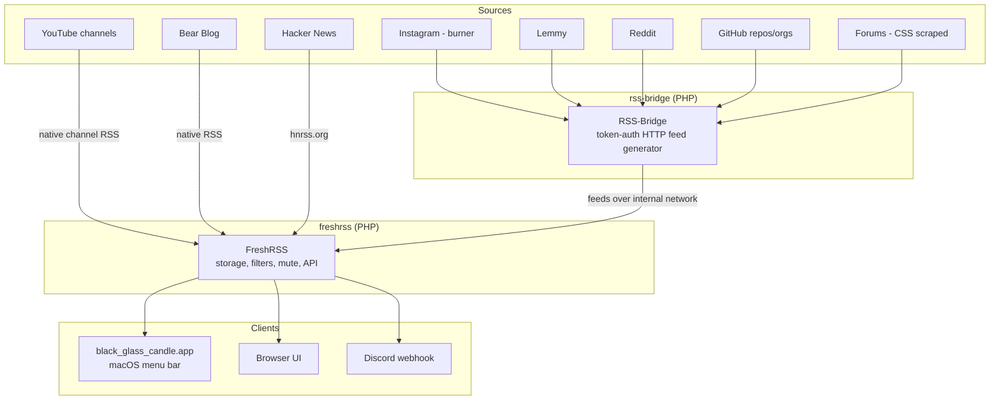
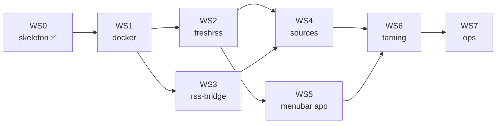

# Implementation Plan

**Project:** black_glass_candle — a finite, chronological, algorithm-free reading hub
**Status:** ready to build
**Upstream input:** [`agent_scaffold_plan.md`](./agent_scaffold_plan.md) (tutorial form; this document is the buildable form)

---

## 1. Goal

One place to read everything you have chosen to follow, with no recommendation engine,
no infinite scroll, and no engagement mechanics. A single chronological stream that
stops when you reach the bottom.

## 2. Non-goals

- Not a social product. No sharing, no commenting, no public instance.
- Not a replacement for a browser. Long-form reading still happens at the source.
- Not a mobile app. Mobile access is the existing FreshRSS web UI.

## 3. Architecture

**Why two applications.** RSS-Bridge turns "sites that have no feed" into feeds.
FreshRSS stores, deduplicates, categorises and schedules. They are different jobs with
different failure modes; keeping them separate means a broken bridge cannot corrupt the
feed database.

**Why a menu bar app.** The whole point is to remove the pull of an infinite feed. A
menu bar item that says "7 unread" and opens to exactly those 7 is the opposite of an
algorithm. It also surfaces the one number that matters without opening anything.

---

## 4. Workstreams

Each workstream is independently verifiable. Do not start the next until the acceptance
check passes.

### WS0 — Repository skeleton

| Item | Detail |
| --- | --- |
| Deliverables | `.gitignore`, `.env.example`, `.env`, `README.md`, `docs/`, `scripts/` |
| Key files | `.gitignore`, `.env.example` |
| Acceptance | `git check-ignore -q --no-index .env` exits 0; `git status --short` never lists `.env`; every secret-shaped path in the repo is ignored |
| Status | ✅ done |

> The `.gitignore` is written **before** `.env` exists on purpose. A credentials file
> that appears in `git status` once is already too late.

### WS1 — Native service infrastructure

| Item | Detail |
| --- | --- |
| Deliverables | `scripts/install.sh`, `scripts/gen-configs.sh`, `scripts/services.sh`, launchd agents |
| Acceptance | `./scripts/install.sh` completes; all three launchd agents report `running`/`scheduled`; both endpoints answer on loopback; `./scripts/healthcheck.sh` reports no failures |

Requirements that the upstream scaffold omits and that this plan adds:

| # | Requirement | Why |
| --- | --- | --- |
| 1 | `CRON_MIN` wired to a launchd `StartCalendarInterval` | Without it the refresh job is never scheduled and feeds silently never update. The instance looks healthy while going stale. |
| 2 | `TZ` passed to PHP as `date.timezone` | A wrong TZ does not error; it silently shifts every date and breaks "today" filters. |
| 3 | Both listeners bound to `127.0.0.1` | Binding to all interfaces exposes the login page to the whole local network. |
| 4 | Logs written under `private/logs` | Without a location you control, diagnosing a crash means guessing. |
| 5 | A healthcheck on each service | A crashed process is otherwise indistinguishable from a quiet news day. |
| 6 | `private/` gitignored before it is populated | A credentials file that appears in `git status` once is already too late. |

### WS2 — FreshRSS configuration

| Item | Detail |
| --- | --- |
| Deliverables | Running instance with admin user, API enabled, API password set, categories created, Youlag installed |
| Acceptance | `curl` `POST /api/greader.php/accounts/ClientLogin` with `Email` + `Passwd` returns a line beginning `Auth=` |

> ⚠️ **First-run only.** `FRESHRSS_INSTALL` and `FRESHRSS_USER` are consumed exactly once,
> when the `freshrss_data` volume is empty. Editing `.env` afterwards has **no effect**.
> To change them you must `docker compose down -v`, which deletes every subscription.
> Change values in the web UI instead.

Categories to create: `Tech`, `Forums`, `Social`, `Video`, `Reading`.

### WS3 — RSS-Bridge configuration

| Item | Detail |
| --- | --- |
| Deliverables | `rss-bridge-config/config.ini.php` generated from `.env`, token auth active, bridge allowlist applied |
| Acceptance | `http://127.0.0.1:3000/?action=display&bridge=CssSelectorBridge&format=Atom&token=$RSSBRIDGE_TOKEN` is rejected without a valid token; a wrong token returns `401`; `config/`, `cache/` and `bridges/` all return `404` |

The explicit allowlist is a security control, not tidiness: RSS-Bridge ships 400+ bridges,
several of which make server-side outbound requests on your behalf.

### WS4 — Source onboarding

| Item | Detail |
| --- | --- |
| Deliverables | Every source in [`source_catalog.md`](./source_catalog.md) subscribed and receiving items |
| Acceptance | Each catalog row has a `verified` date; no feed shows a persistent error in FreshRSS |
| Blocked by | The feed list only you can supply — see [`inputs_required.md`](./inputs_required.md) §A6 |

### WS5 — Menu bar application

| Item | Detail |
| --- | --- |
| Deliverables | `black_glass_candle.app`, built by `scripts/build.sh` |
| Acceptance | Candle appears in the menu bar; unread count updates without restarting the app; clicking opens the popover; "Open FreshRSS" launches the web UI; app relaunches cleanly after `./scripts/services.sh stop` (shows a *stack down* state, not a crash) |
| Design | [`menubar_app.md`](./menubar_app.md) |

### WS6 — Taming the flow

| Item | Detail |
| --- | --- |
| Deliverables | Categories, mute/hide rules, filter rules, optional Discord webhook |
| Acceptance | The "All Articles" stream is something you actually want to read, and you reach the end of it |

This is the workstream that delivers the actual goal. WS1–WS5 are plumbing.

### WS7 — Operations

| Item | Detail |
| --- | --- |
| Deliverables | `scripts/backup.sh`, `scripts/restore.sh`, `scripts/upgrade.sh`, `scripts/healthcheck.sh` |
| Acceptance | A backup restored into a **clean** volume reproduces every subscription and category |
| Runbook | [`operations.md`](./operations.md) |

---

## 5. Sequencing

**Critical path: WS0 → WS1 → WS2 → WS5.** That produces a working menu bar reader
soonest. WS3/WS4 are additive and can be paused at any point without breaking reading.
WS7 should be done *before* WS4 if you value the subscription list — re-entering 40 feed
URLs by hand is genuinely punishing.

---

## 6. Risks

| Risk | Likelihood | Impact | Mitigation |
| --- | --- | --- | --- |
| Instagram bridge breaks after a Meta change | High | Low | `ENABLE_INSTAGRAM=0` flag; Instagram is one category, quarantined from the rest |
| Cookie expiry for Instagram | Certain | Low | Documented re-paste procedure; failure shows as an empty feed, not a crash |
| Forum CSS selectors rot when the forum restyles | Medium | Medium | One `FORUM_TARGETS` line per forum; breakage is isolated to that line |
| Reddit rate-limits the anonymous bridge | Medium | Medium | `RSSBRIDGE_USER_AGENT` escape hatch; Reddit OAuth credentials as fallback |
| Re-running `FRESHRSS_INSTALL` with changed values does nothing | High (if unaware) | High | Documented above and in `.env.example`; the failure is silent, which is why it is called out twice |
| Unbacked-up feed database lost | Low | High | WS7 moved earlier in the sequence; `backup.sh` before WS4 |
| Menu bar app pins a macOS version you later move off | Low | Low | Single `platforms:` line in `Package.swift` |

---

## 7. Decision log

| Decision | Rationale |
| --- | --- |
| Native PHP services over containers | On macOS, Docker keeps volumes inside one opaque VM disk image that Time Machine excludes, and its own docs advise against putting a database on a bind mount — so "data in a private folder" and "Docker on macOS" were mutually exclusive. PHP was already installed, so dropping containers cost no new dependency. |
| Document root set to FreshRSS's own `p/` directory | Makes the personal-data directory structurally unreachable over HTTP rather than merely unlinked. Verified with requests, not assumed. |
| A router script in front of RSS-Bridge | Its document root must also hold `config.ini.php` (the token) and a cache directory. The router permits only `/` and `/static/`. |
| Native Swift menu bar app over a SwiftBar plugin | Matches the existing `DS-mon` toolchain, shares its build script shape, and gives real SwiftUI for the popover. |
| Keychain over a custom encrypted key file | Removes an entire class of "where did the key file go" bugs. A hand-rolled AES-GCM key file has to manage its own permissions, backup and migration; the Keychain is strictly less to get wrong. |
| Programmatic icon over bundled PNG | No binary assets in git, no `.process()` resource declarations to keep in sync, and a template image adapts automatically to light/dark menu bars. |
| Explicit bridge allowlist over `enabled_bridges[] = *` | Least privilege on a service that fetches arbitrary URLs on request. |
